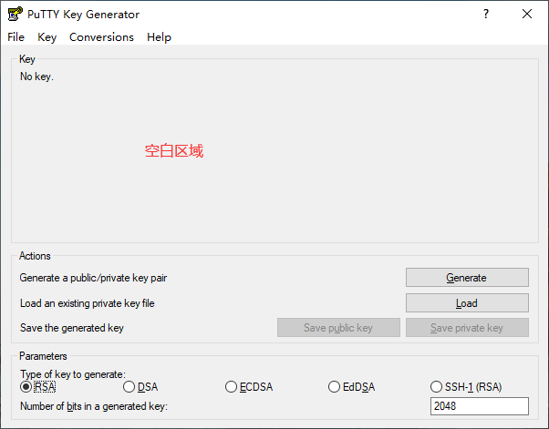
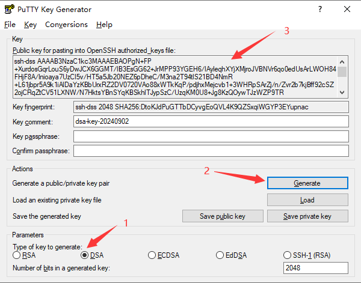

SFTP 服务器需要一个 2048 bits 的 DSA 密钥，果断掏出以下命令：

```bash
ssh-keygen -t dsa -b 2048
```

但是反馈以下错误，提示 DSA 密钥长度必须为 1024 bits：

```
Invalid DSA key length: must be 1024 bits
```

搜索得知 ssh-keygen 不支持生成 2048 bits 的 DSA 密钥，但是 puttygen 支持。操作流程如下：

<!-- truncate -->

1、下载 puttygen.exe，下载链接如下：
    
    - 64-bit x86 https://the.earth.li/~sgtatham/putty/latest/w64/puttygen.exe
    - 32-bit x86 https://the.earth.li/~sgtatham/putty/latest/w32/puttygen.exe
    - 64-bit Arm https://the.earth.li/~sgtatham/putty/latest/wa64/puttygen.exe

2、运行 puttygen.exe，显示如下界面：

    

3、选择 `DSA` -> 点击 `Generate` -> 在`空白区域随机移动鼠标`，生成的如下界面：

    

    :::tip
    图中的 2048 用于设置密钥长度为 2048 bits
    :::

4、点击 `Save public key` 保存公钥，点击 `Save private key` 保存私钥。

    :::tip
    保存的私钥是 putty 格式的，可以点击顶部菜单 `Conversions` -> `Export OpenSSH key` 
    导出 OpenSSH 格式的私钥。
    :::